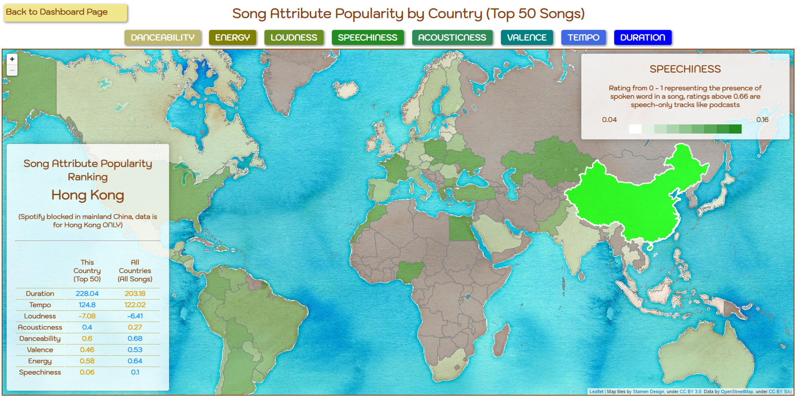
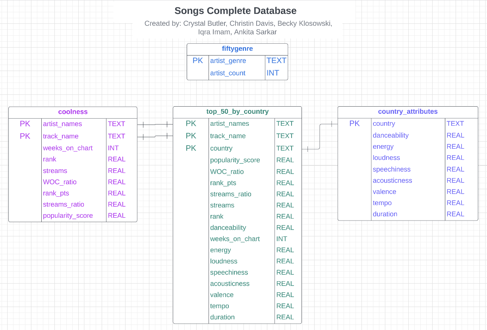

# Song Attributes vs. Popularity
- - -

- - -
## **Project Structure:**

Completed Project Dashboard can be found HERE

Files:
- Jupyter Notebooks
- Resources
- Static
- Template
- app.py

## **Background:**
What truly makes a song popular? To answer this, analyzed the impact a song's attributes have on it's popularity. In order to do this, we looked at an dataset from Kaggle, Spotify Weekly Top 200, which is a dataset that contains songs from Spotify's 'Weekly Top Songs' for each country between 2021 to 2022. 

## **Part 1: Exploratory Data Analysis and creating Data Frames**
1. The initial data set required cleaning and filtering in order for it to be used for the future steps. Certain columns were removed due the the size, which impacted the CSV being read. 

2. The columns that were used in the CSV were artist name, track name, rank, weeks on chart, streams, danceability, energy, loudness, speechiness, acousticness, valence, tempo, duration and country. The cleaned data set was then divided into different data frames which would then be used to make different tables. 

3. Since more than one attribute in the data represent in on a song's popularity, we had to create a way to quantify that data. Average rank in the top 200, average number of streams, and maximum weeks on chart all needed to be considered when determining a song's popularity. We created a "Popularity Score" that represented this data and ranked the data using this score. It was calculated as follows:

Popularity Score = ((average rank/highest rank of songs) + (average number of streams/highest average of song streams) + (max weeks on chart of song/max weeks on chart of all songs))/3

4. These tables created were: 
  - 'country_attributes', which looks at the songs and their attributes, and then groups them together by countries
  - 'top_fifty_genres' which showed the top 50 genres based on the number of artists. 
  - 'coolness' looks at the how popular a song is with it's rank, streams, weeks on the chart, and popularity score. 
  - 'all_countries_top_fifty' looks at the top fifty songs for each country based on it's popularity.  These tables were then all exported to CSVs.

## **Part 2: Converting the Databases to a sqlite database**

1. After all the data frames were created, we imported sqlite3 to create our database. Once sqlite was running, the dataframes were then converted into sql files, and tested to see if the file was working. 

2. For the songs_complete database, we created four tables to represent the relevant data: coolness, country_attributes, fiftygenre and all_countries_top_50. 
- - -

- - - 

## **Part 3: Flask and SQLAlchemy to create App**

1. To complete this, Flask and SQLalchemy were first imported, and an engine was created with 'songs_complete_db.sqlite'. Python was linked to the database by creating a SQLAlchemy session.

2. Routes were created for:
  - @app.route('/')
  - @app.route('/map')
  - @app.route('/attributes/<attribute>')
  - @app.route('/countries/<country>')

## **Part 4: Create JavaScript for HTML**
1. A geojson of country polygons was used to create choropleths for each song attribute by country.

2. An infobox was created to display more detailed information for each country, ranking the song attributes in order of greatest difference between the countries top 50 songs average and the total average of the whole dataset per song attribute.

3. Minor stylistic features were added to highlight user interactivity and allow the user to switch between the map and a static dashboard displaying other statistics:
  - Top 10 Artists Worldwide
  - Song Attribute Distribution
  - Top 10 Songs in Spotify
  - Song Attribute Correlation Heatmap

- - -

## Resources:
Original dataset on [Kaggle](https://www.kaggle.com/datasets/yelexa/spotify200).  
More information on the meanings of each song attribute can be found [here](https://developer.spotify.com/documentation/web-api/reference/#/operations/get-several-audio-features) and [here](https://www.kaggle.com/code/mohitkr05/spotify-data-visualization).  
Country borders provided by [jalbertbowden](https://github.com/datasets/geo-countries) under the [Open Data Commons Public Domain Dedication and License](https://opendatacommons.org/licenses/pddl/1-0/).  
Choropleth library can be found [here](https://github.com/timwis/leaflet-choropleth/).  
Map tiles by Stamen Design, under CC BY 3.0. Data by OpenStreetMap, under CC BY SA.
